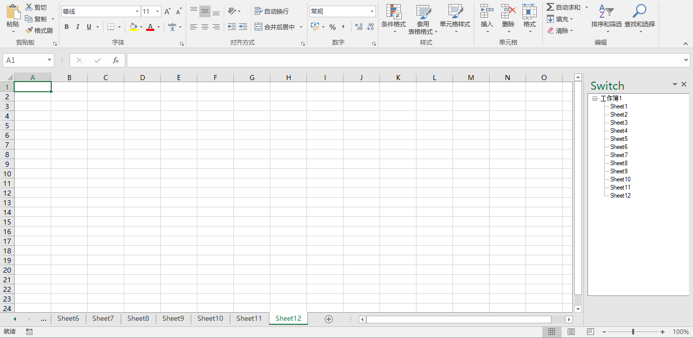

# Switch
Switch is a simple tree view navigator for Excel.

This is for my friend Ye and others who have suffered from the default navigation bar of Excel. I am not sure if there is any commercial solution to this problem, but I hope you find this add-in helpful.

For the executable binary, please refer to the [release page](https://github.com/seanzw/Switch/releases).

